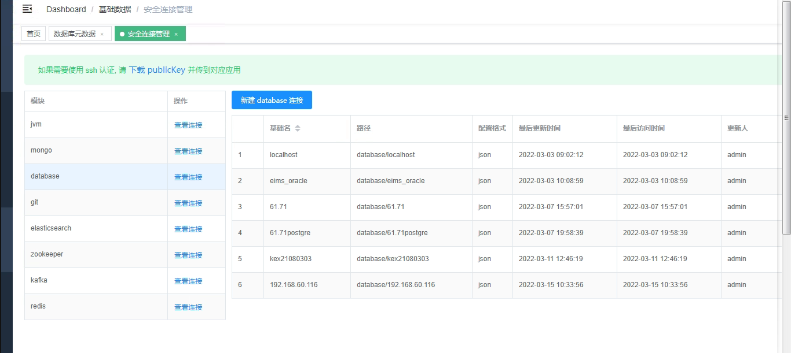
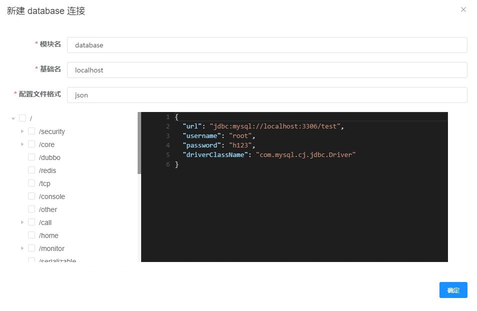

[](https://gitee.com/sanri/sanri-tools-maven/members)[](https://gitee.com/sanri/sanri-tools-maven/stargazers)


# 开始

## 简介
sanritools 是一个开发辅助神器， 想解决开发过程中一些小而必须要的数据可视化， 数据监控，数据调用的问题。


## 工具理念和定位

1. 轻量级,快速启动,只依赖于文件系统,可以自行决定要不要添加权限模块 
2. 多模块,可插拨设计,只加载想要的工具
3. 工具定位
   * 数据可视化, Redis, Kafka 之类的数据明文展示
   * 数据监控, 一些服务器信息, jvm 信息的监控
   * 数据调用, 可以进行无环境的数据调用, 如 Dubbo , Soap, Mybatis 
   * 代码生成, 模板代码, 通用项目的代码生成， 数据库文档等
4. 本工具主要适用于开发, 不能用于监控生产数据

## 安装

1. 下载最新版本 release [去下载](https://gitee.com/sanri/sanri-tools-maven/releases/)

2. 下载依赖的 jar 包， 并解压   sanritoolslib [下载地址](https://cowtransfer.com/s/0df01e65aaca4f)

3. 启动项目

   ```shell
   java -Dloader.path=sanritoolslib --data.path.base=/tmp -Xms256m -Xmx256m -jar sanritools.jar
   ```

[常见问题](/FAQ)

## 快速上手

在项目启动成功后，就可以添加连接并使用工具提供的能力了。

登录系统默认帐号为 admin / 0 , 如果你开启了权限能力的话

后面我将用数据库模块来展示 sanritools 的基本能力

---

### 建立数据库连接 

在 【基础数据】->【安全连接管理】 中找到 database 模块，然后点击【查看连接】按扭，即可查看到当前 database 模块的连接列表



然后点击【新建 database 连接】 即可打开创建 database 连接的对话框 



### 使用元数据功能

元数据搜索做为一个基础的功能，可以对表名，表注释，字段，字段注释和表标签进行搜索


