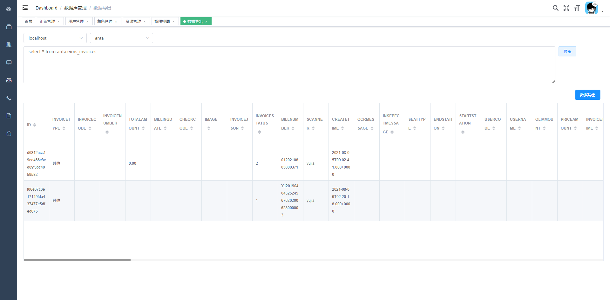

## 数据库模块插件介绍 

数据库模块用于提供系统数据库管理的功能，包括数据库元数据，代码生成，配置数据，数据导出, 随机数据等功能 

### 功能列表

* 数据库元数据 catalog,schema,table,column,index,primary,clientinfo 查询
* 扩展元数据 表类型(字典表,配置表,业务表),表关联关系设置,展示和搜索
* 数据库文档生成和下载
* 使用模板生成代码,组合模板成方案生成代码
* 使用 sql 预览数据库数据和 excel 导出,导入 excel 数据 ,表随机数据生成 
* nacos,diamond 等依赖于数据库的配置数据可以直接展示 
* 强大的搜索功能,可以使用表名,列名,注释,表标记,schema 来搜索表
* 随机数据插入,在压力测试时可以用 , 可以用 spring 表达式,正则,关联另一张表来随机生成表数据
* 元数据比对, 在发版本时, 数据库变更是个薄弱环节, 需要开发人员写变更脚本, 然后由 flyway 或者 Liquibase 执行脚本执行, 这里我可以帮做两库变更, 然后生成可重复执行的 sql 脚本 
* 脏数据清除, 表关系配置后, 可以根据关系查询库中的脏数据, 由用户决定是否需要清除

### 数据库元数据
数据库的元数据在初次使用的时候会加载进内存，所以初次使用时会感觉特别慢，但这是为了后面的搜索功能；

元数据信息包括已经有的元数据信息：表名(catalog，schema，tableName)、字段列表、索引信息、主键信息

扩展的元数据信息包括：表关联关系，即A表a字段和 B 表 b 字段， 形成一对一， 一对多， 多对多的关系(暂不支持多字段关联)


元数据搜索功能，可以根据表名，表注释，字段名，字段注释，表标签进行搜索

### 代码生成
做为一个 sanritools 最早提供的功能，这个功能在网上有很多类似的实现，基本可以分为两类，一类是直接帮你生成固定的模式，只适应于它的项目模板，一类是提供使用模板生成的方式
这两种方式各有利弊，为了省事，一般使用直接生成可用的代码，如果需要二次开发最好是使用模板生成，这里我两种都有提供，并集成了 mybatis，tkmybatis，mybatisplus 的生成方式

#### 模板生成
通过使用变量，将代码整合成模板，然后将多个模板形成一个方案，下次就可以按照这个方案生成多张表的代码，模板目前只支持 freemarker


目前支持的模板变量如下 

1. 通用数据,不管是 javaBean、模板代码、还是项目构建都会有这个数据 
```
author      : 当前作者，取计算机名 
date        : 当前日期 yyyy-MM-dd 
time        : 当前时间 HH:mm:ss
```

2. javaBean 构建时数据 
```
bean        : 当前表对应的 java 实体类信息 ,引用类 JavaBeanInfo
beanConfig  : bean 的配置信息,引用类 JavaBeanBuildConfig
table       : 表元数据信息,引用类 TableMetaData
```

3. 模板代码生成(每一个模板都是针对单张表的生成)
```
bean        : 当前表对应的 java 实体类信息 ,引用类 JavaBeanInfo
table       : 表元数据信息,引用类 TableMetaData
codeConfig  : 如果是模板代码生成 ,引用 CodeGeneratorParam
```

4. 项目构建数据
```
tables      : 表元数据信息,引用类 TableMetaData:List
beans       : 当前表对应的 java 实体类信息 ,引用类 JavaBeanInfo:List
config      : 如果是项目构建,引用 CodeGeneratorConfig
dataSource  : 数据源,引用类 ConnectionMetaData
```

#### mapper 生成
mybatis 的代码生成，可以配置插件，例如 tk.mybatis 代码生成

可以生成 entity， dto， mapper， xml 一整套文件


#### 项目代码生成(还在开发中)
可以直接生成一个项目的代码，下载下来可以直接运行，需要依赖我的项目辅助包

* 响应扩展 framework-webui
* mybatis 扩展 framework-dao
* 权限集成 framework-security
* excel 工具 framework-poi

### 数据管理

#### 配置数据

配置数据用于读取类似 diamond，nacos 的配置数据


#### 数据导出

通过 sql 语句从数据库导出数据，支持海量数据(使用多线程导出)，目前客户端工具虽然都有导出支持，但是都不太友好，并且大量数据导出时可能会卡死



#### 随机数据生成

可以使用随机方法来生成单表数据, 生成方式可以使用随机方法, 固定值, 关联其它表

### 脏数据清除

根据表关系配置, 生成清除语句, 用户可以根据查询数量和 sql 语句决定要不要执行清空

### 数据库的文档生成

提供了一个默认的文档生成, 在表搜索界面时, 可以直接下载搜索到的数据表
