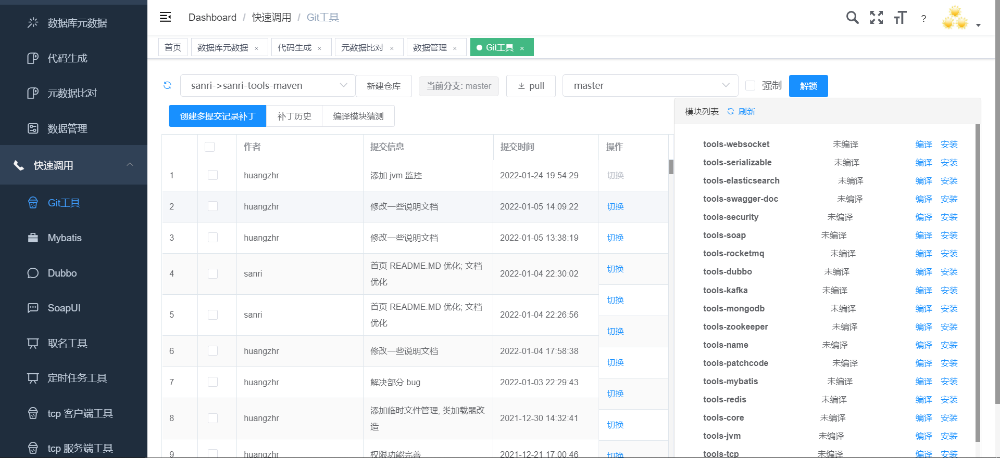

## patchcode模块插件介绍 

主要用于给代码打增量包，添加了本地编译功能，需要依赖于本地 maven 

### 功能列表
* 需要发代码增量包时, 可以进行编译,拉取最新包,并打增量包 
* 依赖于本地 maven 编译
* 重要说明: 
   * 当前只支持 git 仓库, 例: (gitlab,github,gitee), 
   * 编译的实时展示将消耗大量浏览器占用内存, 编译大型项目时需要将编译实时窗口关闭在后台控制台看输出结果 
   * 当 下载仓库或者 pull 出现冲突之类的问题时, 需要手动操作, 目录在 $tmp/gitrepositorys/$group/$repository
   

### 模块算法说明 

[算法说明](README.MD)