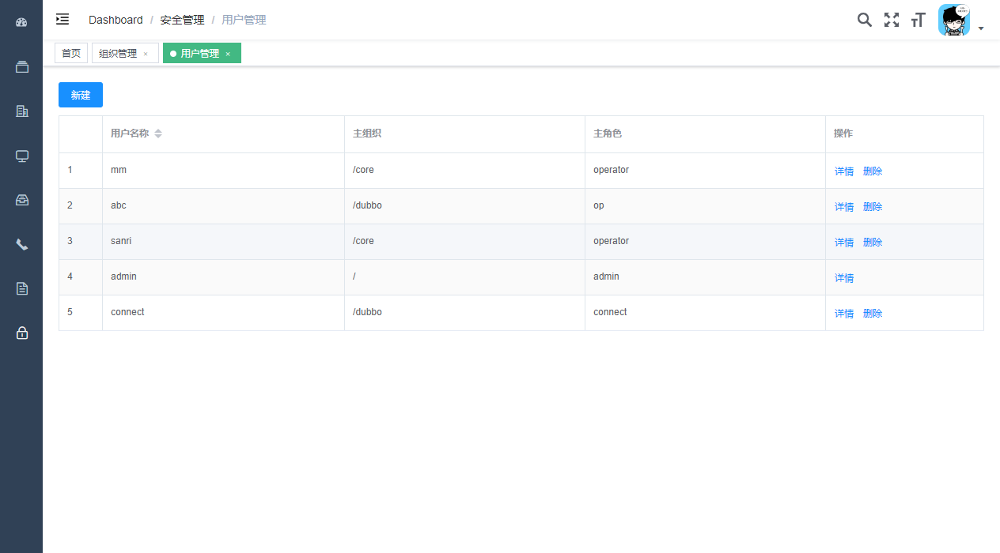
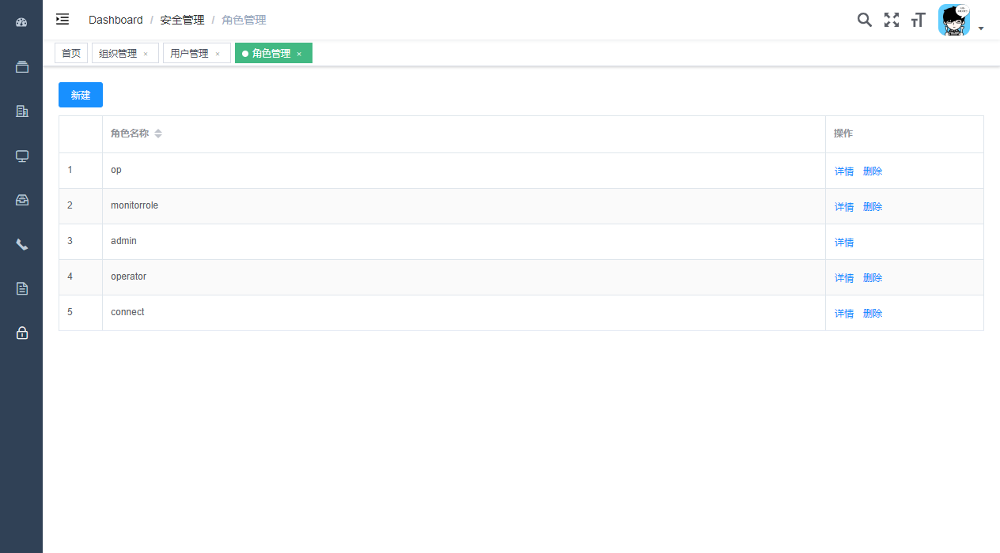
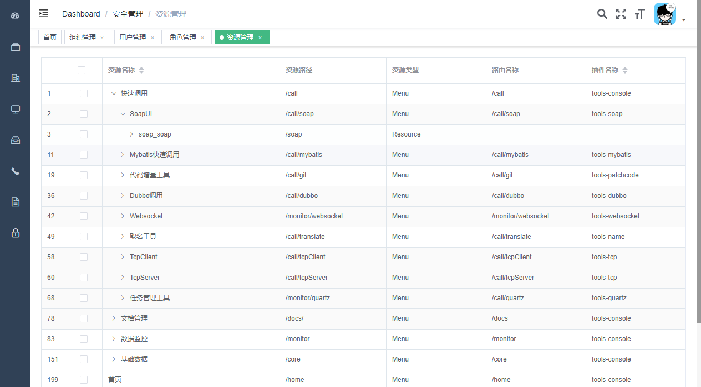
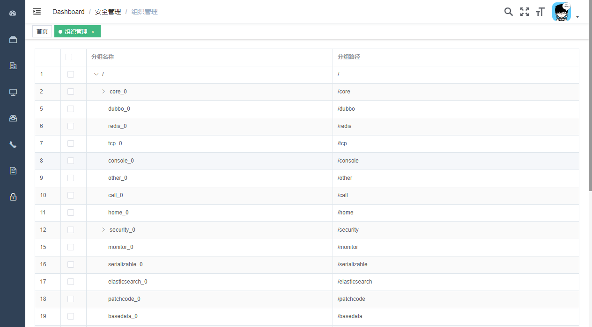
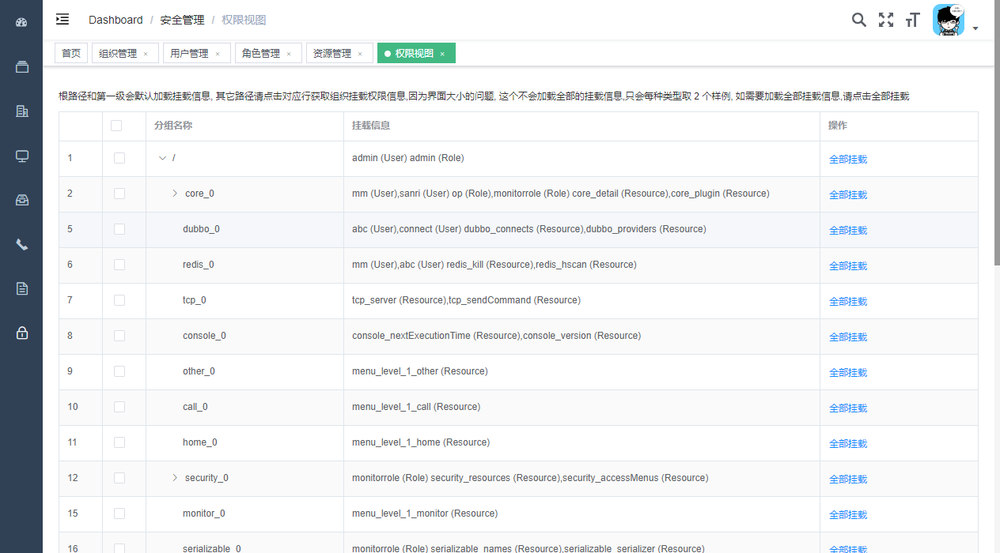
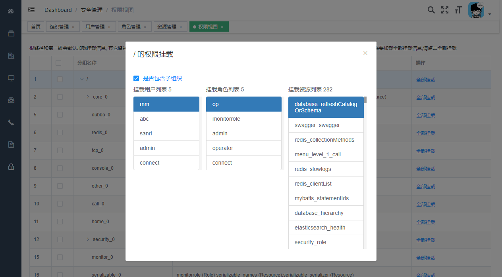

## 权限模块插件介绍 

权限模块用于控制用户的访问，当加入这个模块时，系统拥有了权限的能力，反之没有 

它需要各模块协同合作，提供 3 个文件；`authority.conf`，`menus.conf`，`resources.conf`

### 存储设计
```
grouptop          --admin(User) 
  group1
    group11       --user1(User) --role1(Role) --resource1(Resource)
      group111
        group111  --resource3(Resource)
    group12
  group2          --user1(User) --resource1(Resource)
    group21
 
role1 --resource1(Resource),resource2(Resource)

user1 --role1,role2 group111,group112

Group(name,path)
Role(name,$Groups,$Resource)
Resource(name,$Groups)
User(name,$Roles,$Groups)
```
### 实现说明 
不管代码中还是说明文档,对于安全模块, 组织和分组是一个意思

* 权限访问属性: 用户可以访问哪些权限内容
* 组织属性: 用户可以访问自己所在组织和所有子组织
* 用户属性: 用户可以访问自己所在组织和子组织内的所有用户
* 角色属性: 用户可以访问的角色所在组织和子组织内的所有角色
* 资源属性: 用户可以访问的角色-> 找到角色所有资源 -> 找到资源的组织 -> 组织的顶层列表组织下的所有资源都可以访问

* 权限分配属性: 用户拥有的权限可以分配给用户可访问的用户

后台资源拦截: URL 匹配, 使用每个模块的拦截配置, 没有配置的 url 需要登录才能使用 `authority.conf`

模块资源提供: 可访问的资源(Resource,SubResource)由每个模块给出,在 tools-security 模块动态配置, 可提供动态配置 `resources.conf`

模块菜单提供: 可访问的菜单(Menu,SubMenu), 其实也是资源的一种,可提供动态配置 `menus.conf`

不管用户,角色还是资源,都是有多个分组的, 其中第一个分组为主分组;

### 配置文件
**authority.conf格式说明**

* 每行一个权限配置
* antMatch=角色配置表达式(JS)
* 示例: /security/users/**=admin && data 表示需要 admin 和 data 角色同时存在时才能访问 /security/users 里面的接口

**resources.conf格式说明**

* 每行一个资源配置
* 资源id:资源名称:访问路径:类型(Resource,SubResource):父级资源名称:组织
* 示例: connectlist:连接列表:connect/all:Resource:connect:/core

**menus.conf格式说明**

* 每行一个菜单配置, 菜单id 最好以 menu 开头
* 菜单id:菜单名称:访问路径:类型(Menu,SubMenu):父级菜单名称:组织:路由路径
* 示例: menu_resource:资源管理:/security/resource:Menu:menu_level_1_security:/security/resource:/security/resource
* 因为菜单也是资源的一种,所以前面部分和资源的配置是一致的,然后每个顶级资源需要挂载到对应菜单上

### 数据权限设计
* tools-core 中添加 UserService 接口,由 tools-security 实现
* 每个模块如需要控制数据权限需要自行注入 UserService , 非强依赖方式 `@Autowired(required = false)`
* 当 UserService 不空时, 可以调用里面的方式获取用户属性来控制数据

#### 数据权限最佳实践

安全连接管理类 `com.sanri.tools.modules.core.service.connect.FileBaseConnectService` 使用用户的组织来判断用户的访问数据的权限 

#### 用户管理



#### 角色管理



#### 资源管理



#### 组织管理



#### 权限视图 对应设计中的存储设计



这里描述的只是简单的挂载情况，并没有列全，如需要看详细的，需要点击右边按扭【全部挂载】查看所有的资源挂载信息

